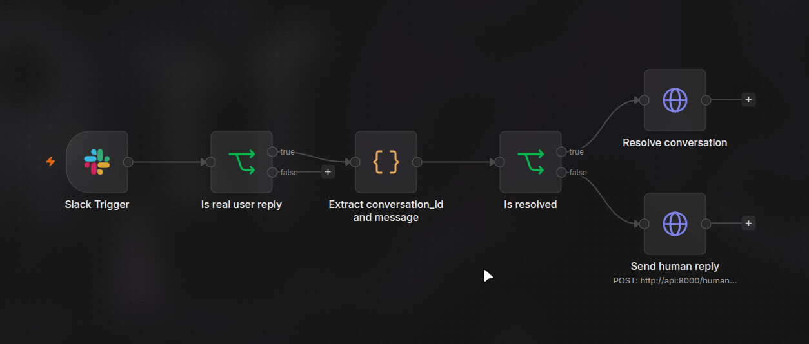

# AI Support Agent

**Multi-Channel AI Customer Support with Hybrid RAG and Human-in-the-Loop Escalation**

A production-oriented customer support backend: a single channel-agnostic core agent serves WhatsApp, Discord, a web widget, and Telegram (via n8n); answers are grounded in a hybrid (dense + keyword) retrieval pipeline over your own documents; conversations that the AI can't confidently handle — or that a customer is visibly frustrated with — are handed off to a human through a structured Slack thread, and handed back automatically once resolved.

<p align="center">
  
  
  
  
</p>
*(`n8n/Workflow_image.png` is a screenshot of an earlier revision of Workflow A and predates the redesign in §8 — kept in the repo for history, not shown here to avoid implying it's current.)*

---

## 1. Project Overview

Customers write in on whatever channel they already use. Every channel connector normalizes its platform-specific payload into one internal message shape and hands it to a single core agent — the agent itself has no idea whether the customer is on WhatsApp, Discord, or the web widget. The agent:

1. Looks up (or creates) the conversation and checks whether a human is already handling it.
2. If not, runs the message through a hybrid RAG pipeline (dense vector search + BM25 keyword search + cross-encoder reranking) grounded in your own documents.
3. Tracks sentiment across the conversation and escalates after repeated negative messages, an explicit "talk to a human" request, or when the retrieval pipeline isn't confident enough to answer safely.
4. On escalation, posts a structured alert to Slack (conversation ID, customer, channel, reason, sentiment — as real message metadata, not just text) and pauses itself for that conversation.
5. A human replies in the Slack thread; the conversation returns to the bot automatically once resolved.

Two n8n workflows sit alongside the FastAPI backend rather than owning the AI logic themselves: one relays Telegram traffic to the same `/chat` endpoint every other channel uses, and one turns Slack thread replies into `/human_reply` and `/resolve` calls.

---

## 2. Architecture

```
┌───────────┐  ┌───────────┐  ┌───────────┐  ┌──────────────────┐
│  WhatsApp │  │  Discord  │  │    Web    │  │  Telegram (n8n)  │
│  webhook  │  │    bot    │  │  frontend │  │   Workflow A     │
└─────┬─────┘  └─────┬─────┘  └─────┬─────┘  └────────┬─────────┘
      │              │              │                 │
      │        each normalizes its payload into an    │
      │        IncomingMessage {channel, customer_id,  │
      │        message, customer_name, metadata}       │
      └──────────────┴──────┬───────┴─────────────────┘
                             ▼
                  ┌─────────────────────┐
                  │   core/agent.py     │   channel-agnostic —
                  │  process_message()  │   no per-channel logic
                  └──────────┬──────────┘
             ┌───────────────┼────────────────────┐
             ▼                                     ▼
   ┌───────────────────┐                 ┌───────────────────────┐
   │   escalation/      │                │        rag/           │
   │ HITL gate, 3-strike│                │ condense → hybrid      │
   │ sentiment, explicit │                │ search (FAISS+BM25,   │
   │ request detection   │                │ RRF) → rerank →        │
   └─────────┬───────────┘                │ threshold → generate   │
             │                            └───────────┬────────────┘
             ▼                                        │
   ┌───────────────────┐                              │
   │   Slack (Web API)  │◄─────────── low confidence ──┘
   │ structured metadata │             triggers escalation
   │  escalation alert   │
   └─────────┬───────────┘
             │ thread reply
             ▼
   ┌─────────────────────┐
   │  n8n Workflow B      │──► POST /human_reply  ──► human_active
   │  (Slack HITL)        │──► POST /resolve/{id} ──► ai_active
   └──────────────────────┘

                  ┌─────────────────────┐
                  │     database/       │  Postgres: conversations,
                  │  Postgres + Redis    │  messages, escalations,
                  │                      │  processed_events (idempotency)
                  └──────────────────────┘
```

---

## 3. Key Features

- **Channel-agnostic core agent** — one pipeline, four connectors, zero per-channel branching in the business logic.
- **Hybrid RAG** — dense (FAISS) + sparse (BM25) retrieval fused with Reciprocal Rank Fusion, cross-encoder reranking (FlashRank), and a similarity-threshold escape hatch that hands off to a human instead of hallucinating.
- **Query condensation** — conversational follow-ups are rewritten into standalone search queries before retrieval.
- **Explicit conversation state machine** — `ai_active → human_pending → human_active → resolved`, not inferred from side queries.
- **Structured Slack HITL** — escalation alerts carry the conversation ID as real Slack message metadata; agents reply in-thread, no `UUID | message` typing convention.
- **Webhook idempotency** — WhatsApp/Telegram retries and Slack Events retries are deduplicated by event ID; a retried delivery never creates a duplicate reply.
- **Persistent conversation memory** — full message history plus a periodically-refreshed long-term summary per conversation.
- **Observability** — Prometheus metrics (`/metrics`), structured logging throughout.
- **Tested without live third-party credentials** — normalizer unit tests + FastAPI integration tests prove the WhatsApp/Telegram adapter chain end-to-end using realistic fixture payloads.

---

## 4. Multi-Channel Connector Architecture

```
connectors/
├── base.py       IncomingMessage / AgentReply — the shared interface
├── whatsapp/      router.py (webhook), client.py (send), normalizer.py
├── telegram/      normalizer.py (n8n Workflow A relays here)
├── discord/       bot.py (separate process), normalizer.py
└── web/           router.py (owns POST /chat), normalizer.py
```

Every connector's only job is: **accept a platform payload → produce an `IncomingMessage` → call `core.agent.process_message()` → send the reply back on that platform.** `core/agent.py` never imports anything channel-specific.

```python
@dataclass
class IncomingMessage:
    channel: str                 # "whatsapp" | "telegram" | "discord" | "web"
    customer_id: str             # customer's id within that channel
    message: str
    customer_name: str | None = None
    conversation_id: str | None = None   # filled in by core.agent after lookup
    metadata: dict = field(default_factory=dict)  # e.g. event_id for idempotency
```

WhatsApp and the Web endpoint are real inbound routes on the FastAPI app. Discord and Telegram are different: Discord's bot is a separate long-running process (a persistent gateway connection, not a webhook) that calls `POST /chat`; Telegram has no dedicated webhook in this codebase at all — n8n's Workflow A receives it and relays it to the exact same `/chat` endpoint using the same request shape, with a `channel` field so the right normalizer runs.

---

## 5. RAG Architecture

```
question + chat_history
        │
        ▼
 condense_query()          rewrites follow-ups into a standalone search query
        │
        ▼
 hybrid search              FAISS (dense, cosine) + BM25 (sparse) in parallel,
 (rag/retriever.py)         fused with Reciprocal Rank Fusion
        │
        ▼
 rerank()                   FlashRank cross-encoder reranks the fused candidates
 (rag/reranker.py)
        │
        ▼
 similarity threshold       if the top reranked score < RAG_SIMILARITY_THRESHOLD
 (default 0.65)             (default 0.65) → fallback answer + escalate, skip the LLM call
        │ passes
        ▼
 generate()                 DeepSeek, grounded only in the retrieved chunks
```

All of this is async — the FAISS/BM25 calls run via `asyncio.to_thread` so a slow retrieval never blocks the event loop during webhook handling, and all LLM calls use `AsyncOpenAI`.

---

## 6. Human-in-the-Loop Workflow

```
Customer message
      │
      ▼
 core.agent.process_message()
      │
      ├─ HITL gate: conversation already escalated? → forward to Slack thread, don't re-run the bot
      ├─ explicit "talk to a human"? → escalate immediately
      ├─ RAG confidence below threshold? → escalate, don't guess
      └─ 3 consecutive negative-sentiment messages? → escalate
      │
      ▼
 escalation/slack.py: send_slack_alert()
      │  Block Kit message + Slack message metadata:
      │  { event_type: "support_escalation",
      │    event_payload: { conversation_id, channel, customer_id } }
      ▼
 Slack channel (#escalations)
      │  agent replies in the THREAD — no special format required
      ▼
 n8n Workflow B (Slack HITL)
      │  fetches the thread's parent message via the Slack Web API,
      │  reads conversation_id back out of its metadata (falls back to
      │  regex-extracting the UUID from the visible text if metadata
      │  is ever missing), then:
      ├─ reply is "resolved"  → POST /resolve/{conversation_id}
      └─ any other reply      → POST /human_reply
      ▼
 conversation state updates, bot resumes once resolved
```

---

## 7. Conversation State Machine

```
                 3-strike sentiment / explicit request / low RAG confidence
   AI_ACTIVE ─────────────────────────────────────────────────────► HUMAN_PENDING
       ▲                                                                 │
       │                                                     agent replies in thread
       │                                                     (POST /human_reply)
       │  human_pending timeout (5 min, nobody engaged)                  ▼
       └─────────────────────────────────────────────────────── HUMAN_ACTIVE
       ▲                                                                 │
       │                              agent (or the workflow) replies "resolved"
       └───────────────────────── RESOLVED ◄───────────────── (POST /resolve/{id})
```

- **`ai_active`** — the bot answers normally.
- **`human_pending`** — escalated, waiting for an agent; the bot forwards messages and tells the customer to wait; auto-resumes to `ai_active` if nobody engages within 5 minutes.
- **`human_active`** — an agent has replied; the bot stays paused indefinitely (no timeout) until a manual `/resolve`.
- **`resolved` / `closed`** — terminal/reporting states; the bot answers normally again.

This is an explicit column (`conversations.status`), not inferred by re-querying message history at read time. `/human_reply` transitions `human_pending → human_active` itself; `/resolve/{id}` transitions anything back to `resolved`. Duplicate Slack/WhatsApp webhook deliveries are deduplicated by `(source, event_id)` in a `processed_events` table before they can touch conversation state twice. Every conversation is scoped by its own UUID, so concurrent conversations never interfere with each other.

---

## 8. n8n Architecture

**n8n does not run or own the AI logic.** It's two small pieces of glue around the FastAPI backend, which is the only place the agent, RAG, and escalation logic live.

- **Workflow A — Customer Support Gateway** (`n8n/My workflow.json`): `Webhook → validate/normalize → POST /chat → respond`. Used today to relay Telegram traffic (the field names — `telegram_chat_id` — are historical); could front any other webhook-based channel the same way.
- **Workflow B — Slack HITL** (`n8n/slack_hitl_workflow.json`): `Slack Trigger → filter bot/non-thread messages → fetch thread parent's metadata → resolve conversation_id → POST /human_reply or /resolve/{id}`.

**Important**: n8n stores and executes the workflow once it's imported and activated — you do not manually run it per message. A `Webhook` node listens continuously once the workflow is **Active**; a `Slack Trigger` node subscribes to Slack Events the same way. See §21–22 for the actual import/activate steps.

---

## 9. Supported Connectors

| Connector | Transport | Where the logic lives |
|---|---|---|
| WhatsApp | Meta Cloud API webhook, direct to FastAPI | `connectors/whatsapp/` |
| Discord | Persistent gateway connection, separate process | `connectors/discord/bot.py` |
| Web | Direct HTTP from the Next.js frontend | `connectors/web/` |
| Telegram | Relayed through n8n Workflow A | `connectors/telegram/` (normalizer only — no dedicated webhook route exists in this codebase) |

---

## 10. Testing Matrix

| Component | Implemented | Locally Tested | Live Integration Tested | Notes |
|---|---|---|---|---|
| Discord | Yes | Yes (normalizer + `/chat` integration test) | Previously verified live pre-refactor; not re-verified against the current module layout this session | Needs `docker compose up --build discord` + a real bot token to re-confirm |
| Web | Yes | Yes | Yes — full HTTP+Postgres+Redis round trip (escalation → human_reply → resolve) run against an isolated stack this session | RAG/LLM calls used a placeholder key, so generation itself wasn't live-tested — retrieval/threshold/state-machine behavior was |
| Telegram | Yes | Yes (normalizer unit test + `/chat` integration test with a realistic n8n-shaped fixture payload) | No | Requires a real Telegram bot + n8n instance I don't have access to |
| WhatsApp | Yes | Yes (normalizer unit tests + FastAPI `TestClient` integration tests with a real Meta Cloud API-shaped fixture, incl. duplicate-delivery idempotency and non-message events) | No | Requires Meta WhatsApp Business API credentials |
| Slack HITL | Yes | Partial — FastAPI side verified to degrade gracefully with no Slack credentials configured; Workflow B's JSON validated as well-formed | No | Requires a real Slack App (bot token, `chat:write` + `channels:history` scopes) to verify the live metadata round-trip |
| RAG (hybrid + rerank + threshold) | Yes | Yes — ingested a real test document, confirmed hybrid retrieval + reranking correctly separates a relevant query (score 1.0, answers) from an irrelevant one (score 0.0, falls back + escalates) | No | No live LLM key used; generation call itself wasn't exercised against the real DeepSeek API |
| Human handoff / state machine | Yes | Yes — full lifecycle (`ai_active → human_pending → human_active → resolved`) and the 5-minute timeout auto-resume path both verified against a real isolated Postgres | N/A (internal logic, not a third-party integration) | |

Run the automated parts yourself:

```bash
python -m pytest tests -v
```

---

## 11. Local Development

```bash
git clone https://github.com/Shahzaib30/ai-support-agent.git
cd ai-support-agent
python -m venv .venv && source .venv/bin/activate
pip install -r requirements-dev.txt        # includes requirements.txt + pytest
cp .env.example .env                       # then fill in real values
```

---

## 12. Docker Setup

```bash
docker compose up -d postgres redis        # core dependencies
docker compose up -d api                   # FastAPI backend
docker compose up -d discord               # Discord bot (needs DISCORD_BOT_TOKEN)
docker compose up -d frontend              # web widget
docker compose up -d prometheus grafana    # optional: monitoring
docker compose up -d n8n                   # optional: n8n automation
```

Or everything at once: `docker compose up -d`. All credentials come from `.env` — nothing is hardcoded in `docker-compose.yml`.

---

## 13. Environment Variables

See [.env.example](.env.example) for the full, current list with comments (LLM, Discord, WhatsApp, Slack, Postgres, Redis, RAG, sentiment, monitoring). Every variable the code actually reads is listed there — nothing else is consumed silently.

---

## 14. Database Setup

Fresh install:

```bash
psql -U postgres -f db/schema.sql
```

Upgrading an existing deployment:

```bash
psql -U postgres -d ai_support_agent -f db/migrations/001_long_term_memory_hitl.sql
psql -U postgres -d ai_support_agent -f db/migrations/002_conversation_state_machine.sql
```

Both migrations are idempotent — safe to re-run. Migration 002 introduces the explicit conversation state machine (backfilling `active`/`escalated` into `ai_active`/`human_pending`/`human_active` based on whether an agent had already replied), a `channel` column on `conversations`, `slack_message_ts` on `escalations` (for threading), the `processed_events` idempotency table, and widens `messages.role` to fit `'human_agent'` (the original `VARCHAR(10)` column was one character too short — a real bug in every install prior to this migration).

---

## 15. Running FastAPI

```bash
uvicorn api.main:app --reload
```

Health check: `curl localhost:8000/health`. Interactive docs: `localhost:8000/docs`.

---

## 16. Running Discord

```bash
python -m connectors.discord.bot
```

Requires `DISCORD_BOT_TOKEN` and `API_URL` (defaults to `http://api:8000`, correct inside docker-compose's network).

---

## 17. Running the Web Connector / Frontend

```bash
cd frontend
npm install
npm run dev
```

Reads `NEXT_PUBLIC_API_URL` (falls back to `http://localhost:8000`).

---

## 18. Testing Telegram Using Mock Payloads

No live Telegram credentials are needed to verify the adapter chain:

```bash
python -m pytest tests/unit/test_telegram_normalizer.py tests/integration/test_chat_route_channels.py -v
```

These use [`tests/fixtures/telegram_chat_request.json`](tests/fixtures/telegram_chat_request.json) — the exact shape n8n's Workflow A sends — and assert the resulting `IncomingMessage` (channel, customer_id, message, event_id) is correct, with `core.agent.process_message` mocked so no LLM/DB call is needed.

To manually exercise the real route the same way n8n would:

```bash
curl -X POST localhost:8000/chat -H "Content-Type: application/json" \
  -d '{"telegram_chat_id":"123","message":"hi","customer_name":"Alex","channel":"telegram"}'
```

---

## 19. Testing WhatsApp Using Mock Payloads

```bash
python -m pytest tests/unit/test_whatsapp_normalizer.py tests/integration/test_whatsapp_webhook.py -v
```

[`tests/fixtures/whatsapp_text_message.json`](tests/fixtures/whatsapp_text_message.json) is a realistic Meta Cloud API webhook body; [`whatsapp_status_event.json`](tests/fixtures/whatsapp_status_event.json) is a non-message delivery-receipt event that should be ignored. The integration tests also cover duplicate-delivery idempotency (the same `wamid.*` message id posted twice should only be processed once) and webhook verification (`GET /whatsapp`).

To manually POST a mock payload against a running server:

```bash
curl -X POST localhost:8000/whatsapp -H "Content-Type: application/json" \
  -d @tests/fixtures/whatsapp_text_message.json
```

---

## 20. Running n8n

```bash
docker compose up -d n8n
```

Open `http://localhost:5678` and log in with `N8N_BASIC_AUTH_USER` / `N8N_BASIC_AUTH_PASSWORD` from your `.env`.

---

## 21. Importing n8n Workflows

Inside n8n: **Workflows → Import from File** → select `n8n/My workflow.json`, then repeat for `n8n/slack_hitl_workflow.json`. Both exports have had real credential IDs and instance identifiers stripped for public sharing — after import, n8n will show each Slack node's credential as disconnected. Click it and select (or create) your own Slack credential; nothing else in the workflow needs to change.

---

## 22. Activating Production Workflows

Once credentials are reconnected, open each workflow and flip the **Active** toggle (top right). An active `Webhook` node listens continuously at its URL from then on; an active `Slack Trigger` subscribes to Slack Events the same way. **You do not manually execute these workflows per message** — that only happens automatically, for every incoming event, once the workflow is active. Use the **Test workflow** button (which gives you a temporary test webhook URL) only while you're still building/debugging a workflow, before activating it.

---

## 23. Slack HITL Setup

1. Create a Slack App at [api.slack.com/apps](https://api.slack.com/apps) (from scratch, not from a manifest).
2. Add Bot Token Scopes: `chat:write`, `channels:history` (or `groups:history` if your escalations channel is private).
3. Install the app to your workspace, copy the **Bot User OAuth Token** into `SLACK_BOT_TOKEN`.
4. Create (or pick) a channel for escalations, invite the bot to it, and put its channel ID into `SLACK_CHANNEL_ID`.
5. Under **Event Subscriptions**, enable events and subscribe to `message.channels` (or `message.groups` for a private channel) — this is what powers n8n's Slack Trigger node in Workflow B.
6. Make sure n8n's own process has `SLACK_BOT_TOKEN` available as an environment variable — Workflow B's "Fetch escalation thread parent" node reads it via `{{ $env.SLACK_BOT_TOKEN }}` to call the Slack Web API directly (needed to read back message metadata, which an Incoming Webhook cannot do).

---

## 24. Example API Requests

```bash
curl -X POST localhost:8000/chat -H "Content-Type: application/json" \
  -d '{"telegram_chat_id":"session-1","message":"What is your refund policy?","customer_name":"Jordan","channel":"web"}'
```

```json
{
  "answer": "You can request a full refund within 30 days of purchase...",
  "escalated": false,
  "cache_hit": false,
  "sentiment_label": "neutral",
  "sentiment_score": 0.0,
  "conversation_id": "50084f38-ae0d-4f13-9d32-b77cd16d50dc"
}
```

---

## 25. Example Escalation

```bash
curl -X POST localhost:8000/chat -H "Content-Type: application/json" \
  -d '{"telegram_chat_id":"session-1","message":"I want to talk to a human","channel":"web"}'
```

```json
{
  "answer": "I'll connect you with a human agent right away. Please wait — someone from our team will be with you shortly.",
  "escalated": true,
  "conversation_id": "50084f38-ae0d-4f13-9d32-b77cd16d50dc",
  "...": "..."
}
```

A Block Kit message lands in `#escalations` with the conversation ID, customer name, channel, reason, and reply instructions — with `conversation_id` also attached as structured Slack message metadata.

---

## 26. Example Human Reply

An agent replies in the Slack thread — no special format:

> Hi, I've checked your account — the refund was already processed on the 4th.

Workflow B resolves the thread back to its conversation and calls:

```bash
curl -X POST localhost:8000/human_reply -H "Content-Type: application/json" \
  -d '{"conversation_id":"50084f38-...","message":"Hi, I have checked your account...","agent_name":"Jamie","event_id":"1716400123.000200"}'
```

The conversation moves to `human_active`; the bot stays paused for it.

---

## 27. Example Resolved Conversation

Agent replies `resolved` in the same thread:

```bash
curl -X POST localhost:8000/resolve/50084f38-ae0d-4f13-9d32-b77cd16d50dc
```

```json
{"status": "resolved", "conversation_id": "50084f38-...", "message": "Bot will now resume answering messages."}
```

The bot resumes answering for that conversation on the very next message.

---

## 28. Project Structure

```
ai-support-agent/
│
├── connectors/          channel adapters, normalized to IncomingMessage
│   ├── base.py
│   ├── whatsapp/         router.py, client.py, normalizer.py
│   ├── telegram/         normalizer.py (n8n Workflow A relays here)
│   ├── discord/          bot.py (separate process), normalizer.py
│   └── web/              router.py (owns POST /chat), normalizer.py
│
├── core/
│   └── agent.py          the single channel-agnostic pipeline
│
├── database/             Postgres pool, conversations, messages, escalations,
│                         idempotency, cache, stats — all persistence
│
├── escalation/           HITL gate, 3-strike sentiment, explicit-request
│                         detection, Slack (Block Kit + metadata)
│
├── api/
│   ├── main.py            FastAPI init, middleware, router includes only
│   ├── metrics.py         Prometheus counters/gauges
│   └── routes/            health, stats, resolve, human_reply, messages, ingest
│
├── rag/
│   ├── ingest.py          load → chunk → embed → FAISS + BM25 index
│   ├── retriever.py       async hybrid (dense + BM25) search, RRF fusion
│   ├── reranker.py        cross-encoder reranking (FlashRank)
│   ├── condenser.py       standalone-query rewriting
│   └── chain.py           orchestrates the above + similarity threshold
│
├── sentiment/
│   └── analyzer.py       async LLM sentiment classification
│
├── tests/
│   ├── fixtures/          realistic sample webhook payloads
│   ├── unit/               pure-function tests (normalizers, escalation logic)
│   └── integration/        FastAPI TestClient tests, core agent mocked
│
├── n8n/                  Workflow A (Customer Support Gateway), Workflow B (Slack HITL)
├── db/                   schema.sql + migrations
├── monitoring/           Prometheus + Grafana provisioning
├── frontend/             Next.js web widget
├── .env.example
├── requirements.txt / requirements-dev.txt
└── README.md
```

---

## 29. Security Considerations

- No secrets are committed — `.env` is gitignored; `docker-compose.yml` reads every credential from environment variables with no hardcoded fallback values.
- The n8n workflow exports in this repo have had real credential IDs, webhook UUIDs, and instance identifiers stripped; you reconnect your own Slack credential after import (§21).
- WhatsApp/Telegram webhook deliveries and Slack Events retries are deduplicated server-side (`processed_events`), so a retried delivery can't double-post a reply or double-insert a message.
- The WhatsApp webhook verifies Meta's `hub.verify_token` challenge before responding.
- CORS is currently wide open (`allow_origins=["*"]`) for local development — restrict this before any public deployment.
- Least-privilege Slack scopes: only `chat:write` and `channels:history`/`groups:history` are needed — nothing broader.

---

## 30. Limitations

- Telegram and WhatsApp connectors are implemented and locally tested against realistic mock payloads, but **not live-integration-tested** — I don't have credentials for either. See the testing matrix (§10).
- The Slack HITL metadata round-trip (posting with metadata, then reading it back via `conversations.replies`) is implemented and unit-reasoned-through but not verified against a real Slack workspace.
- No CI pipeline yet — tests must be run manually (`python -m pytest tests`).
- No authentication on the FastAPI endpoints themselves — appropriate for the current webhook-secret-based trust model (WhatsApp's verify token, Slack's own request signing via n8n's credential), but worth hardening (e.g. a shared secret on `/human_reply`/`/resolve`) before wider exposure.
- Grafana dashboards aren't provisioned yet — Prometheus metrics are exposed and scraped, but there's nothing in `monitoring/grafana/dashboards/` to visualize them out of the box.

---

## 31. Future Improvements

- [ ] Live-test Telegram and WhatsApp against real accounts once credentials are available.
- [ ] CI pipeline (GitHub Actions) running `pytest` on every PR.
- [ ] Pre-built Grafana dashboards for the existing Prometheus metrics.
- [ ] Shared-secret or signature-based auth on the internal HITL endpoints (`/human_reply`, `/resolve`).
- [ ] Voice message transcription (Whisper) for WhatsApp/Telegram.
- [ ] Multi-language support.
- [ ] A dedicated human-agent dashboard instead of Slack as the only agent-facing surface.

---

## Why This Architecture?

This isn't a Telegram bot with an LLM bolted on — it's a small, honest example of the same shape real support-automation platforms use:

- **Multi-channel by construction** — adding a fifth channel means writing one normalizer, not touching the agent.
- **Knowledge-grounded, not just fluent** — hybrid retrieval + reranking + a real confidence threshold, so the bot says "I don't know" instead of inventing an answer.
- **Conversation memory** — full history plus a rolling long-term summary, so context survives long conversations without re-sending everything to the LLM every turn.
- **Intelligent, auditable escalation** — three independent triggers (explicit request, sentiment, retrieval confidence), each logged with a reason.
- **Real human takeover, not a chat log dump** — the bot actually stops answering while a human is engaged, and hands back automatically.
- **API-first** — every channel, including Slack HITL, is just a client of a small set of HTTP endpoints. Automation platforms (n8n here, could be anything else) are consumers of that API, not where the logic lives.
- **Extensible** — the connector interface is four fields and a dict; a new channel is a normalizer function, not a fork of the agent.

### Demo Flow

```
Customer asks a question
        │
        ▼
AI retrieves relevant knowledge (hybrid search + rerank)
        │
        ▼
AI responds, grounded in that knowledge
        │
        ▼
Difficult / uncertain / repeatedly-frustrated → escalation triggered
        │
        ▼
Slack receives a structured alert (conversation ID, reason, sentiment)
        │
        ▼
Human replies in the thread — no special syntax
        │
        ▼
Reply relayed back to the customer on their original channel
        │
        ▼
Human replies "resolved"
        │
        ▼
AI resumes answering that conversation automatically
```

---

## Author

**Shahzaib Shafique** — AI Engineer | Generative AI | RAG | AI Agents | Automation

- GitHub: [@Shahzaib30](https://github.com/Shahzaib30)
- LinkedIn: [s-shahzaib](https://linkedin.com/in/s-shahzaib)
- Portfolio: [shahzaib30.github.io](https://shahzaib30.github.io)
