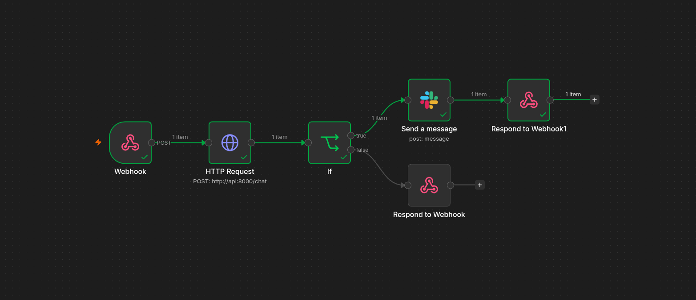
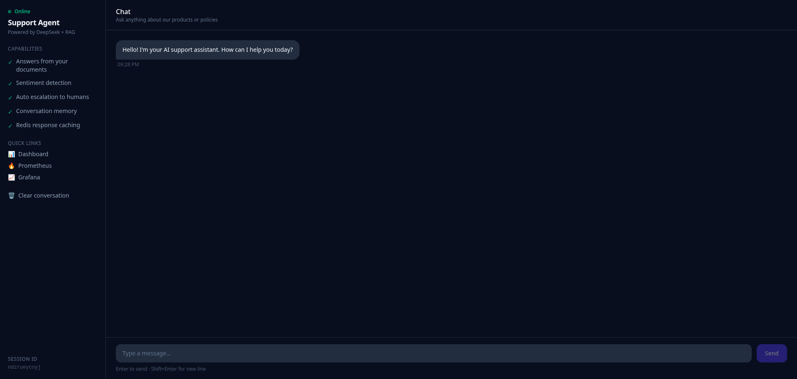

# 🤖 AI Customer Support Agent with Memory & Auto-Escalation

An end-to-end **AI-powered customer support automation system** built with **n8n, RAG, DeepSeek, PostgreSQL, and Telegram**.

The system automatically receives customer messages, searches company knowledge using **Retrieval-Augmented Generation (RAG)**, generates context-aware responses, analyzes customer sentiment, escalates frustrated customers to human agents, creates support tickets when the AI lacks confidence, and maintains complete conversation memory.

> **From customer message → knowledge retrieval → AI response → sentiment analysis → escalation → database logging — everything is automated.**

---

## Demo

### n8n Automation Workflow

The entire customer-support pipeline is orchestrated through an n8n workflow.



### Customer Support UI



---

## 🎯 What This Project Does

A customer sends a message through Telegram.

The system then automatically:

1. Receives the message through the **n8n workflow**
2. Retrieves relevant information from company documents using **RAG**
3. Sends the retrieved context to **DeepSeek**
4. Generates a grounded customer response
5. Sends the response back to Telegram
6. Performs **sentiment analysis**
7. Tracks the customer's sentiment over time
8. Escalates conversations after repeated negative messages
9. Creates a Notion support ticket when the AI cannot confidently answer
10. Stores conversations and sentiment data in PostgreSQL
11. Generates a daily support summary for management

No human intervention is required unless the system determines that escalation is necessary.

---

# 🧠 Why RAG?

One of the most important parts of this project is the **Retrieval-Augmented Generation (RAG)** pipeline.

A general-purpose LLM does not automatically know a company's:

- Products
- Pricing
- Policies
- Refund rules
- Documentation
- FAQs
- Internal procedures
- Support guidelines

Instead of relying entirely on the model's pre-trained knowledge, this system first **retrieves relevant information from the company's own documents**.

### Traditional LLM

```text
Customer Question
       │
       ▼
     LLM
       │
       ▼
  Generated Answer
```

The problem is that the model may not know company-specific information and can potentially hallucinate.

### RAG-powered system

```text
Customer Question
       │
       ▼
Document Retrieval
       │
       ▼
Relevant Company Information
       │
       ▼
DeepSeek + Retrieved Context
       │
       ▼
Grounded Answer
```

This makes the support agent significantly more useful for **domain-specific customer support**.

### RAG Pipeline

```text
Company Documents
       │
       ▼
Document Loading
       │
       ▼
Text Chunking
       │
       ▼
Embeddings
       │
       ▼
FAISS Vector Store
       │
       ▼
Semantic Search
       │
       ▼
Relevant Context
       │
       ▼
DeepSeek
       │
       ▼
Customer Response
```

The key advantage is that the LLM is not expected to memorize the company's knowledge.

Instead, the system **retrieves the relevant information at query time**.

---

# 🏗️ System Architecture

```text
                    ┌──────────────────┐
                    │     Telegram     │
                    │     Customer     │
                    └────────┬─────────┘
                             │
                             ▼
                    ┌──────────────────┐
                    │   n8n Webhook    │
                    └────────┬─────────┘
                             │
             ┌───────────────┼────────────────┐
             │               │                │
             ▼               ▼                ▼
      ┌─────────────┐ ┌─────────────┐ ┌──────────────┐
      │     RAG     │ │  Sentiment  │ │ PostgreSQL   │
      │   Pipeline  │ │   Analysis  │ │   Memory     │
      └──────┬──────┘ └──────┬──────┘ └──────────────┘
             │               │
             ▼               ▼
      ┌─────────────┐   ┌─────────────┐
      │  DeepSeek   │   │ Escalation  │
      │     LLM     │   │   Logic     │
      └──────┬──────┘   └──────┬──────┘
             │                 │
             ▼                 ▼
      ┌─────────────┐    ┌─────────────┐
      │  Telegram   │    │    Slack    │
      │    Reply    │    │    Alert    │
      └─────────────┘    └─────────────┘

             Low Confidence
                   │
                   ▼
            ┌─────────────┐
            │   Notion    │
            │   Ticket    │
            └─────────────┘

                   │
                   ▼
            ┌─────────────┐
            │    Daily    │
            │   Summary   │
            └──────┬──────┘
                   │
                   ▼
                Manager
```

---

# ⚙️ Tech Stack

| Layer | Technology |
|---|---|
| Workflow Automation | **n8n** |
| LLM | **DeepSeek API** |
| RAG Framework | **LangChain** |
| Vector Database | **FAISS** |
| Backend / RAG | **Python** |
| Database & Memory | **PostgreSQL** |
| Messaging | **Telegram Bot API** |
| Notifications | **Slack API** |
| Ticket Management | **Notion API** |
| Automation Scheduling | **n8n** |

---

# 🚀 Core Features

### 🧠 RAG-Powered Customer Support

Retrieves relevant information from company documentation before generating an answer.

This allows the AI agent to answer questions using **company-specific knowledge** rather than relying solely on the LLM's general knowledge.

---

### 💬 Telegram Integration

Customers can communicate directly with the AI support agent through Telegram.

```text
Customer
   │
   ▼
Telegram
   │
   ▼
n8n
   │
   ▼
AI Support Agent
   │
   ▼
Telegram Response
```

---

### 📊 Sentiment Analysis

Every incoming message is analyzed for customer sentiment.

The system tracks sentiment over the course of the conversation rather than treating every message independently.

Example:

```text
Message 1 → Positive
Message 2 → Neutral
Message 3 → Negative
Message 4 → Negative
Message 5 → Negative
                    │
                    ▼
             🚨 Escalation
```

---

### 🚨 Automatic Human Escalation

If a customer sends **3 consecutive negative messages**, the workflow automatically alerts a human support agent through Slack.

```text
Negative Message
       │
       ▼
Sentiment Analysis
       │
       ▼
Negative?
   │       │
  YES      NO
   │       │
   ▼       ▼
Counter   Continue
   │
   ▼
3 Consecutive?
   │
 ┌─┴─┐
YES  NO
 │    │
 ▼    ▼
Slack Continue
Alert
```

This prevents frustrated customers from being trapped in an automated conversation.

---

### 🎫 Low-Confidence Ticket Creation

The system can identify situations where the RAG pipeline does not provide enough information to confidently answer a customer.

Instead of blindly generating an answer, it creates a **support ticket in Notion** for human review.

```text
Customer Question
       │
       ▼
RAG Retrieval
       │
       ▼
Confidence Check
       │
   ┌───┴────┐
   │        │
High      Low
   │        │
   ▼        ▼
Answer   Notion Ticket
```

This creates an important safety mechanism for AI-powered customer support.

---

### 🧠 Persistent Conversation Memory

Customer conversations are stored in PostgreSQL.

The database can maintain information such as:

- Customer conversations
- Individual messages
- Sentiment scores
- Conversation history
- Escalation state
- Support activity

This allows the system to maintain context instead of treating every customer message as a completely new interaction.

---

### 📧 Automated Daily Reports

The workflow uses the n8n scheduler to automatically generate a daily support summary.

The manager can receive information such as:

- Number of conversations
- Customer sentiment
- Escalated conversations
- Support activity
- AI-generated summaries

No manual reporting is required.

---

# 🔄 Complete Workflow

```text
                    Customer
                       │
                       ▼
                 Telegram Message
                       │
                       ▼
                 n8n Webhook
                       │
          ┌────────────┴────────────┐
          │                         │
          ▼                         ▼
     RAG Pipeline              Sentiment
          │                     Analysis
          │                         │
          ▼                         ▼
   Company Documents          Sentiment Score
          │                         │
          ▼                         ▼
      FAISS Search             Track History
          │                         │
          ▼                         ▼
    Relevant Context        Negative × 3?
          │                    │       │
          ▼                   YES      NO
      DeepSeek                 │       │
          │                    ▼       │
          │                  Slack     │
          │                  Alert     │
          │                            │
          └────────────┬───────────────┘
                       │
                       ▼
                Generate Response
                       │
                       ▼
                 Telegram Reply
                       │
                       ▼
                  PostgreSQL
                       │
                       ▼
                Conversation Memory

             Low Confidence
                    │
                    ▼
              Notion Ticket

             Daily Schedule
                    │
                    ▼
             Manager Report
```

---

# 🗂️ Project Structure

```text
ai-support-agent/
│
├── rag/
│   ├── ingest.py
│   ├── retriever.py
│   └── chain.py
│
├── sentiment/
│   └── analyzer.py
│
├── n8n/
│   └── My workflow.json
│
├── assets/
│   └── ui.png
│
├── Workflow_image.png
│
├── db/
│   └── schema.sql
│
├── docs/
│   └── company documents
│
├── .env.example
├── requirements.txt
└── README.md
```

---

# 🛠️ Installation

## 1. Clone the Repository

```bash
git clone https://github.com/Shahzaib30/ai-support-agent.git

cd ai-support-agent
```

---

## 2. Install Python Dependencies

```bash
pip install -r requirements.txt
```

---

## 3. Configure Environment Variables

Create your environment file:

```bash
cp .env.example .env
```

Then configure the required credentials:

```env
DEEPSEEK_API_KEY=your_key

TELEGRAM_BOT_TOKEN=your_token

SLACK_WEBHOOK_URL=your_url

NOTION_API_KEY=your_key

POSTGRES_URL=your_database_url
```

> **Never commit your `.env` file or API credentials to GitHub.**

---

# ▶️ Two Ways to Run the Project

There are two main ways to run the system depending on whether you want to use the complete automation workflow or work directly with the Python RAG components.

---

## 🥇 Option 1 — Run Through n8n

This is the recommended approach for running the **complete customer-support automation system**.

### Step 1 — Start n8n

Run your n8n instance using your preferred setup.

For a local installation:

```bash
n8n start
```

Then open:

```text
http://localhost:5678
```

---

### Step 2 — Import the Workflow

Inside n8n:

```text
Workflows
   ↓
Import
   ↓
My workflow.json
```

The exported workflow is located at:

```text
n8n/My workflow.json
```

---

### Step 3 — Configure Credentials

Configure the required n8n credentials for:

- Telegram
- Slack
- Notion
- PostgreSQL
- DeepSeek / HTTP API

---

### Step 4 — Activate the Workflow

Once credentials and configuration are complete:

```text
Workflow
    ↓
Test
    ↓
Activate
```

Your Telegram support agent is now ready to receive messages.

---

# 🥈 Option 2 — Run the RAG Pipeline Directly

The RAG components can also be run independently from n8n.

This is useful when developing, testing, or modifying the retrieval system.

### Step 1 — Prepare Documents

Place company documentation inside:

```text
docs/
```

For example:

```text
docs/
├── faq.pdf
├── products.pdf
├── refund-policy.pdf
└── support-guide.txt
```

---

### Step 2 — Ingest Documents

Run:

```bash
python rag/ingest.py --docs ./docs
```

The ingestion pipeline processes the documents and prepares them for semantic retrieval.

---

### Step 3 — Run / Test the Retriever

The retrieval layer can then be tested independently before connecting it to the full n8n automation.

This makes development easier because the RAG system can be validated separately from Telegram, Slack, Notion, and the rest of the automation stack.

---

# 🗄️ Database Setup

Create the PostgreSQL database/schema using:

```bash
psql -U postgres -f db/schema.sql
```

The database is responsible for maintaining the application's persistent conversation memory.

Conceptually:

```text
Customer
   │
   └── Conversation
          │
          ├── Message
          ├── Message
          ├── Sentiment
          └── Escalation State
```

---

# 📚 RAG Pipeline in Detail

The RAG system follows a standard retrieval-augmented architecture.

### 1. Document Ingestion

Company documents are loaded into the system.

### 2. Chunking

Large documents are divided into smaller meaningful chunks.

### 3. Embeddings

Document chunks are converted into vector representations.

### 4. FAISS Indexing

The vectors are stored in a FAISS index for efficient similarity search.

### 5. Query Retrieval

When a customer asks a question, the question is converted into a vector and compared against the indexed documents.

### 6. Context Injection

The most relevant document chunks are passed to DeepSeek as context.

### 7. Response Generation

DeepSeek generates the final response using the retrieved company information.

```text
                 Company Knowledge
                        │
                        ▼
                 ┌─────────────┐
                 │  Documents  │
                 └──────┬──────┘
                        ▼
                    Chunking
                        │
                        ▼
                   Embeddings
                        │
                        ▼
                  FAISS Index
                        │
                        │
Customer Question ──────┘
        │
        ▼
Semantic Retrieval
        │
        ▼
Relevant Documents
        │
        ▼
      DeepSeek
        │
        ▼
 Grounded Answer
```

---

# 🚨 Escalation Logic

The sentiment system uses a negative-message threshold.

```text
Incoming Message
       │
       ▼
Sentiment Analysis
       │
       ▼
Score: -1.0 → +1.0
       │
       ▼
Is score below threshold?
       │
   ┌───┴────┐
  YES      NO
   │        │
   ▼        ▼
Negative   Continue
 Counter
   │
   ▼
3 consecutive negative messages?
   │
 ┌─┴─┐
YES  NO
 │    │
 ▼    ▼
Slack Continue
Alert
```

The purpose is not to eliminate automation, but to **automatically recognize when human intervention is more appropriate**.

---

# 🔐 Security Considerations

Before deploying this system publicly:

- Keep API keys inside environment variables
- Never commit `.env`
- Restrict database access
- Secure your n8n instance
- Use HTTPS for production webhooks
- Protect Telegram bot credentials
- Restrict Slack and Notion permissions
- Use least-privilege credentials wherever possible

---

# 📈 Future Improvements

Planned improvements include:

- [ ] 🎙️ Voice message transcription with Whisper
- [ ] 🌍 Multi-language customer support
- [ ] 📊 Support analytics dashboard
- [ ] 💬 WhatsApp integration
- [ ] 🧠 Domain-specific model fine-tuning
- [ ] 🔎 Improved RAG evaluation
- [ ] 📝 Automatic conversation summarization
- [ ] 👤 Dedicated human-agent dashboard
- [ ] 📈 Advanced customer sentiment analytics

---

# 💡 Why This Project?

This project demonstrates how modern AI systems can be combined with workflow automation to build a practical customer-support platform.

Instead of building a chatbot that simply sends messages to an LLM, the system combines:

**LLMs + RAG + Memory + Sentiment Analysis + Workflow Automation + Human Escalation**

into a single automated pipeline.

The result is a support agent that can:

> **Retrieve knowledge → understand the customer → respond → remember → detect frustration → escalate when necessary.**

---

# 👨‍💻 Author

## Shahzaib Shafique

AI Engineer | Generative AI | RAG | AI Agents | Automation

- GitHub: [@Shahzaib30](https://github.com/Shahzaib30)
- LinkedIn: [s-shahzaib](https://linkedin.com/in/s-shahzaib)
- Portfolio: [shahzaib30.github.io](https://shahzaib30.github.io)

---

## ⭐ If You Find This Project Useful

Give the repository a ⭐ and feel free to explore the workflow and implementation.